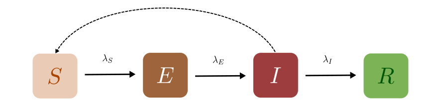
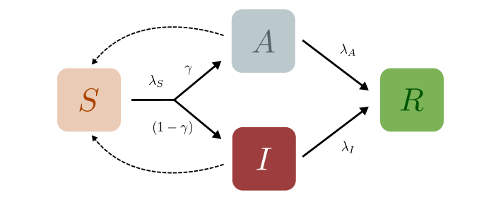
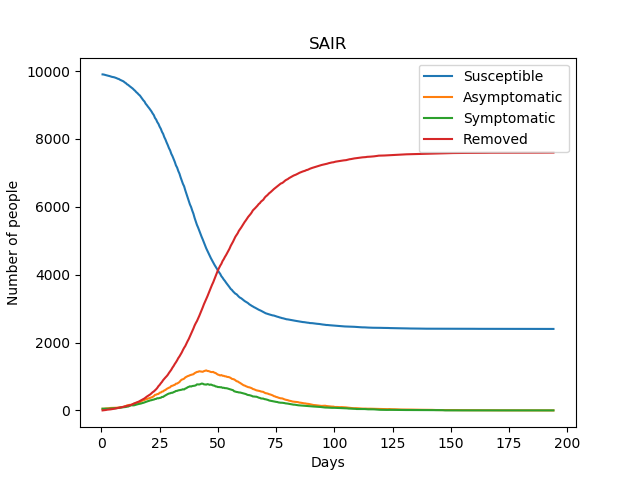
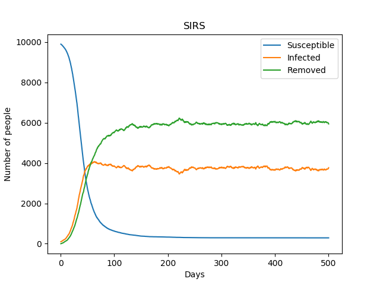

Other Compartmental Models
==========================

The SEIR Model
--------------

This is a generalisation made on the basic SIR model to include the Exposed state of the individuals. The **Exposed** compartment (E) represents incubation period for the disease, that is a latent phase where the individual is infected but not yet infectious. The infected people can infect the ``Susceptible (S)`` people who will be moved to the ``Exposed (E)`` compartment before they are moved to the ``Infected (I)`` compartment. From the infected compartment they will be ``Removed (R)`` eventually.  The diagram below shows how the individuals move through each compartment in this model.

The rate of transmission of the disease from an ``Infected`` to a ``Susceptible`` is represented by :math:`{\lambda_S}`. The incubation rate, :math:`{\lambda_E}`, is the rate of latent individuals becoming infectious. The average time an individual spends in the ``Exposed`` compartment, the incubation period of the disease is thus given by :math:`{1/\lambda_E}`. At last :math:`{\lambda_I}` represents the rate of removal of infected individuals from Infected compartment.

In a closed population with no births or deaths, the SEIR model can be defined using a set of coupled non-linear differential equations described below:

.. math::

  \begin{aligned}
      \dv{S}{t} &= -\lambda_S \frac{SI}{N} \\[10pt]
      \dv{E}{t} &= \lambda_S \frac{SI}{N} - \lambda_E E \\[10pt]
      \dv{I}{t} &= \lambda_E E - \lambda_I I \\[10pt]
      \dv{R}{t} &= \lambda_I I
  \end{aligned}

where the total population,

.. math::

 N = S + E + I + R

Introducing the incubation period does not change the total number of infections. The incubation period prolongs the duration of the epidemic, but with a short incubation period the peak in the number of infected becomes tall and sharp compared to another model with a longer incubation period. The graphs below show simple SEIR models with incubation periods 5 and 10 days respectively.

.. image:: _static/images/seir2.png
.. image:: _static/images/seir.png

The above equations can be solved numerically to get deterministic results but, as explained in :ref:`The SIR Model`, we can also solve it stochastically using a similar algorithm.

In the algorithm, if the agent is ``Susceptible``, we compute the number of infected individuals they come in contact with who could potentially infect them ($I$). Then, during each time step :math:`{\Delta t}`, they are transferred to the ``Exposed`` compartment, with some probability,

.. math::

 P_\text{SE} = \lambda_S \frac{I}{N}\Delta t

Individuals from the ``Exposed`` compartment are transferred to the ``Infected`` compartment with the probability,

.. math::

 P_\text{EI} = \lambda_E \Delta t

If the agent is already infected, we transition them to the ``Removed`` compartment with a probability

.. math::

 P_\text{IR} = \lambda_I \Delta t.

The SAIR Model
--------------

In the models we have described so far, we have not distinguished between the *types* of infection in which a disease might manifest itself in a population. In many real-world situations, however, we might need to make this distinction. For example, the disease progression of mildly infected individuals might be very different from severely infected individuals. Let us begin by examining a very basic case: a generalisation of the :ref:`The SIR Model` to include both symptomatic ($I$) and asymptomatic ($A$) individuals. Such a distinction might be important to study the spread of epidemics like `COVID-19 <https://www.nature.com/articles/d41586-020-03141-3>`_, especially because asymptomatic individuals are much more likely to spread the disease as they are hard to indentify without extensive testing and contact tracing. From these compartments the individuals move to the Removed ($R$) compartment, at rates $\lambda_A$ and $\lambda_I$ respectively, as shown in the disease progression below.

Let us begin by assuming that there is no difference in the capacity of a single asymptomatic or symptomatic individual to infect a susceptible individual. (It might be, of course, that more asymptomatics are *responsible* for infecting susceptibles because they are less likely to be detected and quarantined, but this is an *emergent* network phenomenon that we will not discuss here.) We call this transition rate out of $S$ $\lambda_S$, as before.

However, we now have a *branching* that could occur. Once infected, a susceptible person could either move to $A$ or $P$. We thus define another quantity $\gamma$ which is the fraction of the infected individuals who are asymptomatic. The individuals then transit out of $A$ or $I$ with rates $\lambda_A$ or $\lambda_I$ respectively. The set of coupled non-linear differential equations that defines the SAIR model in a closed population are:

.. math::

 \begin{aligned}
   \dv{S}{t} &=  -\frac{\lambda_S}{N} S\left(A + I\right) \\[10pt]
   \dv{A}{t} &=  \gamma \frac{\lambda_S}{N} S \left(A + I\right) - \lambda_A A \\[10pt]
   \dv{I}{t} &=  (1-\gamma) \frac{\lambda_S}{N}  \left(A+I\right) - \lambda_I I \\[10pt]
   \dv{R}{t} &= \lambda_A A+ \lambda_I I
 \end{aligned}

where, just as before, the total population is constant:

.. math::

 N = S + I + A + R.

.. admonition:: Exercise
  :class: error

  Convince yourself that if $\lambda_A = \lambda_I$, this model effectively reduces to a simple $SIR$ model. In this case the distinction between the asymptomatics and symptomatics is merely cosmetic.

Modelling the transitions in the SAIR model is a little bit more involved than in the SIR model, though the basic principle is the same.

.. warning::
    One might naively imagine that we could simply write:

  .. math::

    P_\text{SA} &= \lambda_S \gamma \left(\frac{A+I}{N}\right) \Delta t,\\
    P_\text{SI} &= \lambda_S (1-\gamma) \left(\frac{A+I}{N}\right) \Delta t,

  and draw two random numbers  $r_1$ and $r_2$ to check if $P_\text{SA}$ or $P_\text{SI}$ occur. However, this is not strictly correct. The transitions from $S$ to $A$ and from $S$ to $I$ are not independent transitions, and therefore you cannot simply treat them like we have in the previous models. However, there *are* two independent transitions: the transition out of $S$, and the branching to $A$ or $I$.

Thus, at each tick $\Delta t$, susceptible individuals are checked for infection and are moved out of the susceptible compartment with a probability

$$P_\text{Out of S} = \lambda_S \left(\frac{A + I}{N}\right)\Delta t.$$

Now, once they are set to transition, they are either sent to $A$ with a probability $\gamma$, or otherwise they are sent to $I$. The asymptomatic and symptomatic individuals are finally transferred to the ``Removed`` compartment with a probabilities $\lambda_A\Delta t$ and $\lambda_I\Delta t$ respectively.

We can now add one last level of complexity to this problem: what if we wanted to model a situation in which asymptomatic individuals are *less likely* to infect susceptibles (perhaps because they have a lower viral load) than symptomatics. In this case, we would like to include a sort of "relative risk" of infection from an asymptomatic individual that is smaller than the risk of being infected by a symptomatic individual. In order to do this,  we can introduce some "contact parameters" that modulate the $S\to A$ and $S\to I$ transitions. In this case the differential equations can be written as:

.. math::

 \begin{aligned}
   \dv{S}{t} &=  -\frac{\lambda_S}{N} S \left(C_A A + C_I I\right) \\[10pt]
   \dv{A}{t} &=  \gamma \frac{\lambda_S}{N} S\left(C_A A + C_I I\right) - \lambda_A A \\[10pt]
   \dv{I}{t} &=  (1-\gamma) \frac{\lambda_S}{N} S \left(C_A A + C_I I\right) - \lambda_I I \\[10pt]
   \dv{R}{t} &= \lambda_A A+ \lambda_I I
 \end{aligned}

Thus, if $C_I = 1$ and $C_A = 0.5$, then a single asymptomatic individual is only half as likely as a symptomatic individual at infecting a susceptible person.

.. note ::

  Notice how the quantities that really matter re not $C_A$ or $C_I$, but rather $\lambda_S\, C_A$ and $\lambda_S\, C_I$. If you were to choose $C_I = 2$ and $C_A = 1$, in this case as well asymptomatics will be half as likely like to infect susceptibles, but we have effectively *increased* the overall value of $\lambda_S$ because of the factor 2.

.. admonition:: Exercise
  :class: error

  In this case, would setting $\lambda_A = \lambda_I$ reduce this to a simple SIR model, as before? Why not?
  
The SIRS Model
--------------

In the SIR model, the individuals attain life long immunity after getting recovered from the infection, but this is not the case for many diseases. The immunity can decline over time and as a result the recovered individuals can get **reinfected**. The SIRS (``Susceptible`` – ``Infected`` – ``Recovered`` – ``Susceptible``) model allows the transfer of recovered` individuals back to the ``Susceptible`` compartment from where they can get infected again.  The diagram below shows the movement of the individuals through each compartment in an SIRS model.

The infectious rate, $\lambda_S$, controls the rate of spread which represents the probability of transmitting disease between a susceptible and an infectious individual. $\lambda_I$ is the recovery rate which can be determined from the average duration of infection.
$\lambda_R$ is the rate at which the recovered individuals return to the susceptible statue due to loss of immunity.

Ignoring the vital dynamics (births and deaths), in the deterministic form, the SIRS model can be written as the following ordinary differential equations: 

.. math::

 \begin{aligned}
   \dv{S}{t} &= -\lambda_S \frac{SI}{N} + \lambda_R R \\[10pt]
   \dv{A}{t} &= \lambda_S \frac{SI}{N} - \lambda_I I \\[10pt]                                                              
   \dv{R}{t} &= \lambda_I I - \lambda_R R
   \end{aligned} 
   
where the total population is, 

.. math::

 N = S + I + R

On choosing the right parameters, an endemic equilibrium is reached, meaning that the disease never truly dies out, some small fraction of the population is always infected. We could use the SIRS model to include the possibility of reinfection in the SEIR, SAIR models. The plot of a simple SIRS model is shown below: 

    
In the algorithm, during each time step $\Delta t$ the transfer of individuals from Susceptible to the Infected and from Infected to the Recovered compartments is done using the same probability as in an SIR model.

.. math::

 \begin{aligned}
   \ P_\text{SI} = \lambda_S \frac{I}{N} \Delta t\\
   \ P_\text{IR} = \lambda_I \Delta t
 
The recovered individuals upon loss of immunity are transferred back to the Susceptible compartment using probability,

.. math::

 P_\text{RS} = \lambda_R \Delta t
