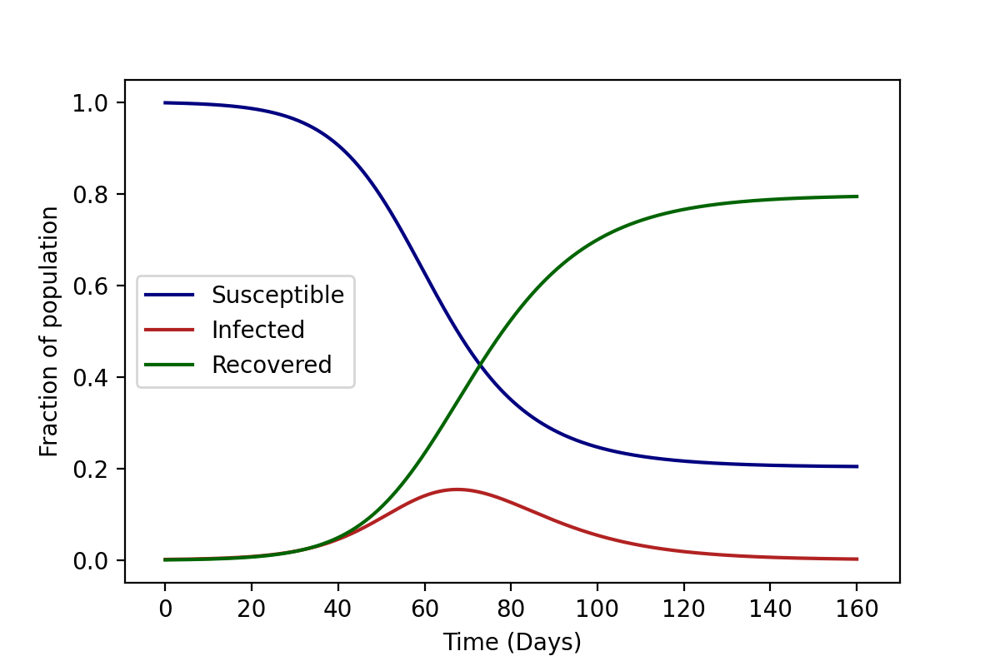
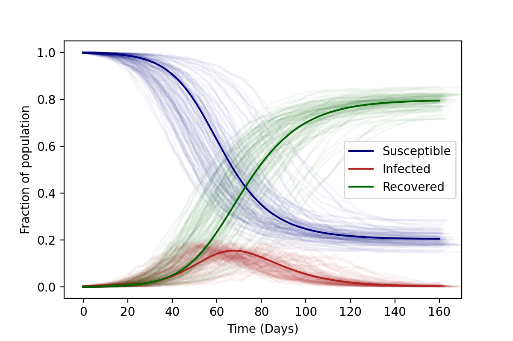

A Basic Introduction to Epidemic Modelling
===========================================

The standard technique to model the spread of epidemics is by using
something called a **compartmental model**. In such models, individuals
can be in one of a number of compartments (or "states"), and can
transition between them as time goes by. In the following section we
will study a very basic, but surprisingly effective model, the **SIR
model.**

The SIR Model
-------------

.. figure:: _static/images/epidemiology_SIR_disease_progression.png
    :align: center
    :alt: The disease progression in the SIR Model
    :figclass: align-center

The SIR model is so named because in it individuals can be in one of
three compartments, (S)usceptible, (I)nfected, and (R)ecovered, at any
given time. Infected individuals can "infect" the Susceptible, causing
them to transition to the Infected compartment, from which they can
eventually recover. In what follows we will use the letters $S$,
$I$, and $R$ to represent both the individual compartments as well
as the numbers in each of these compartments. The context should make it
clear what we are referring to. In addition, we make some assumptions:

1.  Susceptible individuals can only leave this compartment if they have
    been infected. (We ignore birth and death rates.)
2.  The rate of change of $S(t)$, the number of susceptibles, depends
    on the number of individuals currently susceptible, the number
    currently infected, and the amount of contact between susceptibles
    and infecteds.
3.  We also assume that some fixed fraction (say, $\gamma$) of the
    infected group will recover on any given day. Keep in mind that when
    we say someone has "Recovered", what we mean (in this model) is that
    they are no longer infectious or susceptible to the disease and
    therefore cannot contribute to its spread.

Mean-field or "Well-mixed" solution to this model
~~~~~~~~~~~~~~~~~~~~~~~~~~~~~~~~~~~~~~~~~~~~~~~~~

This system is modelled by a set of coupled non-linear first-order
differential equations that should remind some of you of the "rate"
equations you've seen in Chemistry courses.
$$
\begin{equation}
\begin{aligned} \dv{S}{t} &= - \beta\, S(t)\, I(t)\\[10pt]
\dv{I}{t} &= + \beta \, S(t) \, I(t) - \gamma \, I(t)\\[10pt]
\dv{R}{t} &= + \gamma \, I(t) \end{aligned} \tag{1} \label{1}
\end{equation}
$$

.. admonition:: Exercise
   :class: error

    1.  Why is there a negative sign in the equation for $S(t)$?
    2.  Convince yourself that $\beta$ represents the average number of
        contacts per unit time between an infected individual and a
        susceptible individual.
    3.  Show that the total population $N = S+I+R$ is fixed (i.e. that
        this is a **closed system**). This is often a very good check to see
        if your simulation is running correctly!

On some inspection, you should be able to realise that parameter
$\beta$ is a little different from the parameter $\gamma$.
$\gamma$ is quite simply the fraction of infected individuals who
will recover on any given day. $\beta$, on the other hand multiplies
a non-linear term, and represents the probability that an infected
individual comes in contact with a susceptible individual. As a result,
it is actually a composite object $$\text{Transmission coefficient
}\beta = \text{Contact probability } \times \text{ Transmission
rate},$$ in other words each infected individual meets some fraction
of the total number of susceptibles and infects them at some
"transmission rate". Now, this "contact probability" decides how the
transmission of a disease scales up with the population. Two specific
types of "scaling" can be chosen, depending on the type of disease.

1.  **Contact probability = 1.** In this case, we assume that infected
    individuals meet all the susceptibles in one day. Therefore, the
    larger the population, the faster the spread of disease. This can be
    used to model a large number of people crowded in an enclosed space.
    Such a scaling is often appropriate in the case of plant and animal
    diseases. This is known as *density dependent scaling*.

2.  **Contact probability = $\\mathbf{1/N}$.** In this case, we assume
    the infected individual meets a constant number of people (say
    $\lambda_S$) every day. Of these, the fraction of susceptibles
    is $S/N$. This assumption holds for most human diseases, where
    contact is determined by social factors. This is known as *frequency dependent scaling*.

The distinction between these two types of scaling only occurs when the
total population size is not fixed, since otherwise the factor of $N$
could simply be absorbed into the definition of $\beta$. In what
follows, we will be using **frequency dependent scaling**. As a result,
Equation (\ref{1}) above can be rewritten as: $$\begin{equation}
\begin{aligned} \dv{S}{t} &= - \frac{\lambda_S}{N} S I\\[10pt]
\dv{I}{t} &= + \frac{\lambda_S}{N} S I - \lambda_I I\\[10pt]
\dv{R}{t} &= + \lambda_I I \end{aligned} \tag{2} \label{2}
\end{equation}$$

.. admonition:: Exercise
   :class: error

    1.  Show that, because of the extra factor of $N$, the solutions to
        this differential equation will be *independent* of $N$. (**Hint:**
        Rewrite the equations in terms of $s(t) = S(t)/N$, $i(t) =
        I(t)/N$, and $r(t) = R(t)/N$.)
    2.  It turns out that finding the exact solution to this equation as a
        function of time is not possible. However, an implicit solution can be found. By dividing the first and third equations, show that $$s(t) =
        s(0)\,e^{-R_0 r(t)},$$ where the quantity $R_0$ is called
        the **reproductive ratio**. Show that $R_0$ is independent of
        $N$.
    3.  Now, repeat the previous question for the system denoted by Equation
        (\ref{1}). Show that in that case, $R_0$ depends on the total
        population $N$.

The above differential equations represented in Equation (\\ref{2}) can
be easily solved numerically to obtain solutions that look like this:

Of course, these solutions are **deterministic**. The reason for this is
that we assume that a fixed number of individuals transition every day
between compartments, which in turn is a result of using a **well-mixed
population**.

.. note::
  A well-mixed population is one in which any infected
  individual has a probability of contacting any susceptible individual
  that can be approximated reasonably well by the **average** probability
  of susceptible-infected interaction. This is often the most problematic
  assumption, but is easily relaxed in more complex models.

Stochastic solutions to this model
~~~~~~~~~~~~~~~~~~~~~~~~~~~~~~~~~~

But what happens when you cannot approximate the entire population to be
"well-mixed"? In particular, the population could comprise many
individuals who move between their homes and work-places and other
locations. In this case, the number of contacts that an individual agent
has would not necessarily be comparable to those of another agent. For
example, some agents might work in high-density workplaces and come in
contact with many more individuals and spread the disease at a faster
rate than others. Furthermore, we might want to include a heterogeneity
in the population: some agents might intrinsically be more likely to get
infected than others. And lastly we might also want to model different
interventions like a lockdown where only certain agents are allowed to
move, and not others.

For all of the above cases, the well-mixed system is a very bad
approximation, since it assumes that all individuals are identical and indistinguishable. As a result, we need to look at a different approach. One
way to do this is to go down to the level of the individual agents, and
incorporate as much heterogeneity as we want at this level, and then
imagine that these agents move about an infect each other at constant
rates due to their contacts with each other.

This is a far more resource-intensive process, as we now have to keep
track of each individual agent, what their attributes are, and who they
can infect. However, the types of questions that such models can answer
are much more extensive.

The most famous method to solve such systems is known as the `Gillespie
Algorithm <https://en.wikipedia.org/wiki/Gillespie_algorithm>`_. We will
be using a much simpler discrete time approximation of this method.
Below we will start off by considering all the individuals in a single
location, so that everyone is in contact with everyone else. However, in
the next section, we will relax this assumption and allow for networks
of individuals to be formed. The basic idea is as follows:

.. admonition:: Algorithm
   :class: tip

    1.  Divide the total time into steps of \$\\Delta t\$, and at every
        time-step we loop over all agents.
    2.  If the agent is susceptible, we compute the number of infected
        individuals who could potentially infect them ("\$I\$"). Then, with
        some probability \$\$p\_\\text{SI} = \\lambda\_S\\frac{I}{N}\\Delta
        t,\$\$ we transition them to the infected compartment.
    3.  If the agent is already infected, we transition them to the
        recovered compartment with a probability \$\$p\_\\text{IR} =
        \\lambda\_I\\,\\Delta t.\$\$
    4.  If they have recovered, do nothing.
    5.  Repeat the entire process until there are no more infected
        individuals, or the total time has elapsed.

The results of such a stochastic simulation can be seen in the figure
below. There are faint curves represent a large number of stochastic
realisations of the same process, given the same initial conditions. As
you can see, the progress of the disease is no longer deterministic.
However (if all agents are in a single location and therefore
interacting with each other) the average over all of these stochastic
runs will result in the "well-mixed" result. This could serve as another
potential check to your code.

Residence times in different compartments
=========================================

An interesting question to ask at this point is this: what is the probability distribution of times that individuals spend in the infected compartment? It turns out that in standard Markov-Chain Monte-Carlo simulations like the ones we study, the residence times are exponentially distributed. Let us try to explore why this is the case, and see if we can change our earlier algorithm to generalise to non-exponential waiting times.

We are discretising our system into little intervals of time-step $\Delta t$, so that the total time $T= N \Delta t$, where $N$ is the total number of steps. In our disease modelling simulations, we assume that at every step $\Delta t$, an individual has some probability of exiting the compartment they are in, which we will call $p$. (This value of $p$ will depend on many factors, including the number of individuals in that compartment at that time, and so on.)

In order to simulate a probability of $p$, we draw a random number $r$ from a uniform distribution and make the shift if $r<p$. This is just equivalent to saying: $$\begin{equation}\texttt{Make the shift with a probability p}.\end{equation}$$

This is the only role of the uniform distribution here.

Now, let's ask ourselves the following question: *what is the probability that an individual will leave a compartment at some time $t$?*? We will call this probability $$\mathcal{P}\dd t,$$ since it's a probability distribution, and so we can't speak of something occuring exactly at time $t$, but rather in an interval of time between $t$ and $t+\dd t$.

In our scheme, $t= n \Delta t$, and so the question is equivalent to asking: what is the probability that the individual will leave exactly after $n$ steps. This is:

$$\text{Prob. that event occurs exactly after $n$ steps} = (1-p)^n p.$$

Using the fact that $p = \lambda \Delta t$, and that $\Delta t = T/N$, we can show that:
$$
\begin{align}
\mathcal{P}_{\Delta t}(t)\dd t &= (1 - \lambda \Delta t)^{t/\Delta t} \lambda \Delta t\\
&= \left(1 - \frac{\lambda T}{N} \right)^{t N/T} \lambda \Delta t
\end{align}
$$

To find the true probability density, we need to take the limit $N\to\infty$, i.e. $N/T \to \infty$, and so :

$$\mathcal{P}(t)\dd t = \lim_{N/T \to\infty} \left(1 - \frac{\lambda T}{N} \right)^{t N/T} \lambda \Delta t = \lambda e^{-\lambda t} \dd t, $$

so that the probability distribution is: $$\mathcal{P}(t) = \lambda e^{-\lambda t}.$$

.. admonition:: Exercise
   :class: error

    1.  Show that the probability that an individual exits the compartment
        \$I\$ exactly after some time \$t = n \\Delta t\$ is given by:
        \$\$\\mathcal{P}(t)\\,\\Delta t = p\_\\text{IR}
        (1-p\_\\text{IR})\^n.\$\$
    2.  Using the fact that \$p=\\lambda\_I\\,\\Delta t\$, and \$\\Delta t =
        T/N\_\\text{steps}\$ (Where \$T\$ is the total simulation time and
        \$N\_\\text{steps}\$ the total number of steps):
        \$\$\\mathcal{P}(t)\\,\\Delta t = \\left(1 - \\frac{\\lambda\_I
        T}{N\_\\text{steps}}\\right)\^{t N\_\\text{steps}/T}\\, \\lambda\_I
        \\, \\Delta t.\$\$
    3.  Next, take the limit \$N\_\\text{steps}\\to\\infty\$, and \$\\Delta
        t\\to 0\$, keeping \$N\_\\text{steps}\\,\\Delta t = T\$, and argue
        that \$\$\\mathcal{P}(t) = \\lambda\_I \\, e\^{-\\lambda\_I t}.\$\$
        The residence times in the infected compartment are exponentially
        distributed, with mean \$\\tau\_I = 1/\\lambda\_I\$! In other words,
        this is a succession of Poisson processes -- characteristic of
        Markov Chain Monte Carlo processes: happens every time the
        probability of a transition is independent of the history.
    4.  Can the same argument be used to say that the residence time in the
        susceptible compartment is \$\\tau\_S = 1/\\lambda\_S\$? Explain.

Introducing a network structure
===============================

We can now add an additional layer of complexity, by introducing
relations between the agents through their home and work locations.

.. figure:: _static/images/epidemiology_network_schematic.png
    :align: center
    :alt: A schematic of a model network
    :width: 50%
    :figclass: align-center

In such a model, individuals can move between their home and their work
locations, and as a result the total number of individuals in any given
location is not fixed. As a result, we now need to go over every
location, and treat it as a well-mixed location. The algorithm now
becomes:

.. admonition:: Algorithm
   :class: tip

    1.  Divide the total time into steps of $\Delta t$, and at every
        time-step we loop over all agents.
    2.  If the agent is susceptible, we compute the number of infected
        individuals who could potentially infect them ("$I$") in their
        current location. Then, with some probability $$p_\text{SI} =
        \lambda_S\frac{I}{N}\Delta t,$$ we transition them to the
        infected compartment.
    3.  If the agent is already infected, we transition them to the
        recovered compartment with a probability $$p_\text{IR} =
        \lambda_I\,\Delta t.$$
    4.  If they have recovered, do nothing.
    5.  Repeat the entire process until there are no more infected
        individuals, or the total time has elapsed.

Other Compartmental Models
==========================

The SEIR Model
--------------

This is a generalisation made on the basic SIR model to include the Exposed state of the individuals. The **Exposed** compartment (E) represents incubation period for the disease, that is a latent phase where the individual is infected but not yet infectious. The infected people can infect the ``Susceptible (S)`` people who will be moved to the ``Exposed (E)`` compartment before they are moved to the ``Infected (I)`` compartment. From the infected compartment they will be ``Removed (R)`` eventually.  The diagram below shows how the individuals move through each compartment in this model.

.. todo::
  Insert SEIR Model Schematic

The rate of transmission of the disease from an ``Infected`` to a ``Susceptible`` is represented by :math:`{\lambda_S}`. The incubation rate, :math:`{\lambda_E}`, is the rate of latent individuals becoming infectious. The average time an individual spends in the ``Exposed`` compartment, the incubation period of the disease is thus given by :math:`{1/\lambda_E}`. At last :math:`{\lambda_I}` represents the rate of removal of infected individuals from Infected compartment.

In a closed population with no births or deaths, the SEIR model can be defined using a set of coupled non-linear differential equations described below:

.. math::

  \begin{aligned}
      \dv{S}{t} &= -\lambda_S \frac{SI}{N} \\[10pt]
      \dv{E}{t} &= \lambda_S \frac{SI}{N} - \lambda_E E \\[10pt]
      \dv{I}{t} &= \lambda_E E - \lambda_I I \\[10pt]
      \dv{R}{t} &= \lambda_I I
  \end{aligned}

where the total population,

.. math::

 N = S + E + I + R

Introducing the incubation period does not change the total number of infections. The incubation period prolongs the duration of the epidemic, but with a short incubation period the peak in the number of infected becomes tall and sharp compared to another model with a longer incubation period. The graphs below show simple SEIR models with incubation periods 5 and 10 days respectively.

.. image:: _static/images/seir2.png
.. image:: _static/images/seir.png

The above equations can be solved numerically to get deterministic results but, as explained in :ref:`The SIR Model`, we can also solve it stochastically using a similar algorithm.

In the algorithm, if the agent is ``Susceptible``, we compute the number of infected individuals they come in contact with who could potentially infect them ($I$). Then, during each time step :math:`{\Delta t}`, they are transferred to the ``Exposed`` compartment, with some probability,

.. math::

 P_\text{SE} = \lambda_S \frac{I}{N}\Delta t

Individuals from the ``Exposed`` compartment are transferred to the ``Infected`` compartment with the probability,

.. math::

 P_\text{EI} = \lambda_E \Delta t

If the agent is already infected, we transition them to the ``Removed`` compartment with a probability

.. math::

 P_\text{IR} = \lambda_I \Delta t.

The SAIR Model
--------------

In real-world situations one might wish to distinguish between individuals with different types of infections. Hence the SAIR model is introduced. The fraction of infected individuals showing or experiencing no symptoms are categorised as **Asymptomatic** and the other fraction with symptoms are categorised as **Symptomatic**. Individuals from both ``Asymptomatic (A)`` as well as ``Symptomatic (I)`` compartments are moved to the ``Removed (R)`` compartment upon recovery. The diagram below shows how the individuals move through each compartment in this model.

.. todo::
  Insert SAIR Schematic here

The rate of transmission of the disease from an infected to a susceptible is represented by :math:`{\lambda_S}` . Thus, the rate of transfer of an infected individual from the ``Susceptible (S)`` compartment to the ``Asymptomatic (A)`` compartment is :math:`{\lambda_S \gamma}` and to the ``Symptomatic (I)`` compartment is :math:`{\lambda_S (1- \gamma)}`, where :math:`{\gamma}` represents the fraction of the infected individuals who are asymptomatic. At last, :math:`{\lambda_I}`
represents the rate of removal of infected individuals from the ``I`` and ``A`` compartments.

The set of coupled non-linear differential equations that defines the SAIR model in a closed population are:

.. math::

 \begin{aligned}
   \dv{S}{t} =  -\lambda_S \left(\frac{A + I}{N}\right) \\[10pt]
   \dv{A}{t} =  \lambda_S \gamma \frac{A}{N} - \lambda_I A \\[10pt]
   \dv{I}{t} =  \lambda_S \gamma \frac{I}{N} - \lambda_I I \\[10pt]
   \dv{R}{t} = \lambda_I (A+I)
 \end{aligned}

where the total population,

.. math::

 N = S + I + A + R

Introducing the ``Asymptomatic``, ``Symptomatic`` branching neither changes the total number of infections nor affects the total duration of the epidemic.
On the other hand, we could add more complexity to the model by introducing different infection rates ie, making the symptomatic individuals more infectious
than the asymptomatic. We could also make the recovery rates different for the different infected groups. For a simple SAIR model, the graph maybe as shown below.

.. image:: _static/images/sair.png

In an SAIR model, during each tick :math:`{\Delta t}` , the individuals from the ``Susceptible`` compartment are checked for infection and are moved to a transient infected compartment using probability

.. math::

 P_\text{SA} &= -\lambda_S \gamma \left(\frac{A + I}{N}\right)\Delta t \\
 P_\text{SI} &= -\lambda_S (1-\gamma) \left(\frac{A + I}{N}\right)\Delta t

The infected individuals then transit out of this temporary compartment to the ``Asymptomatic`` and ``Symptomatic`` compartments using probabilities
:math:`{\gamma}` and :math:`{(1- \gamma)}` respectively.

The asymptomatic and symptomatic individuals are finally transferred to the ``Removed`` compartment with a probability

.. math::

 P_\text{R} = \lambda_I \Delta t

 Interesting problems to solve
 =============================

.. admonition:: Basic Exercises
  :class: error

   1.  Generalise the simple SIR model to an SEIR model, where the
       susceptibles move into an "exposed" compartment for some time before
       they start being infectious. In this compartment, they cannot infect
       others, nor can they get infected.
   2.  Generalise your SIR model to an SIRD model, where some fraction of
       the infected individuals (say, 1%) transit to the "Dead" compartment
       instead of recovering.
   3.  Generalise the simple SIR model to an SAIR model: infected
       individuals can either be Asymptomatic (\$A\$) or Symptomatic
       (\$I\$), and they can both recover from this state. You will need to
       define new parameters that determine the relative **fraction** of
       asymptomatics, for example.
   4.  For the simple SIR model (or any other model that you prefer),
       compute out the "residence time" distribution for the
       **susceptible** compartment. In other words, find all the times at
       which individual agents transition from \$S\\to I\$, and plot a
       histogram.

.. admonition:: Intermediate Exercises
  :class: error

   1.  How does our simple SIR model scale up with the population \$N\$?
       You will need to study not only the epidemic curves, but also their
       **spread**. Run the SIR model for around 10 or 20 times for a given
       population size (say, 10,000 individuals), and record the output.
       Repeat the process for a population of 20,000, and so on, for as
       high as you can go. Next, find some way to quantify the **spread**
       of the epidemic curves (for example, the standard deviation in the
       number of recovered at the end of the epidemic). Plot a graph that
       shows how this "spread" varies with the initial population \$N\$.
   2.  Generalise the simple SIR model to include reinfections (the SIRS
       model): the recovered people do not stay recovered but -- at some
       rate \$\\zeta\$ -- transit back into the susceptible compartment.
       Try to choose the parameters well such that an **endemic
       equilibrium** is reached, meaning that the disease never truly dies
       out, some small fraction of the population is always infected.
   3.  Introduce a lockdown to a simple SIR model. Say that only some
       fraction of the population (say, only the essential workers) will
       "violate" the lockdown and continue to go to work. Observe what
       happens to the total number of recovered at the end of the epidemic
       as you increase the duration of the lockdown.

.. admonition:: Advanced Exercises
  :class: error

   1.  Consider a simple model with multiple types of infected individuals
       (say, the SAIR model I described above). Introduce the possibility
       that one infected group is much more infectious than another
       infected group. In other words, say that Symptomatic individuals
       ("I") are 2 times more infectious than Asymptomatic individuals.
   2.  For the simple SIR model, in one of the earlier exercises we showed
       that the time that an individual spent in the infected compartment
       was an exponentially distributed Random Number with mean
       \$1/\\lambda\_I\$. Therefore, there should be another way to decide
       how long infected individuals stay in a compartment, instead of
       generating a probability of transitioning at every step \$\\Delta
       t\$. When an individual transits from \$S\\to I\$, choose a fixed
       amount of time randomly drawn from an exponential distribution of
       mean \$\\tau\_I = 1/\\lambda\_I\$. After this time, the individuals
       will exit from \$I\\to R\$.
   3.  Compute the effective reproductive ratio (\$R\$) as a function of
       time. This number is defined as the average number of individuals a
       single infected individual is responsible for having infected. In
       order to do this, whenever an \$S\\to R\$ transition occurs, choose
       one of the infected individuals who could be responsible for this an
       increment some parameter representing the the "number of people they
       have infected". At every time step, average this number out over the
       entire population, and finally plot a graph of this as a function of
       time.
