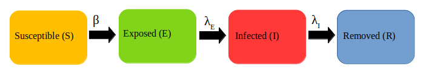
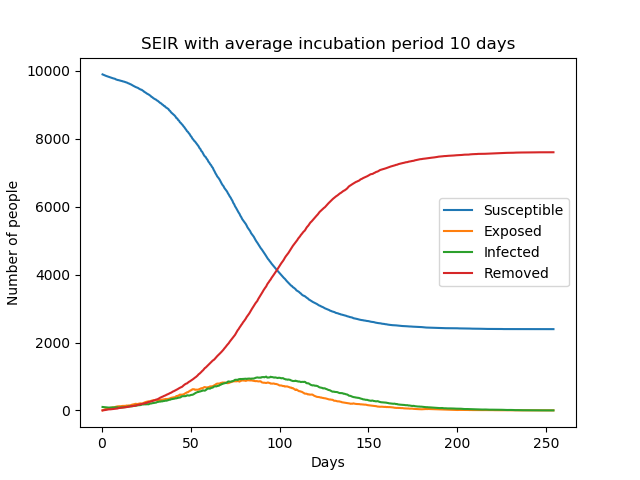

Epidemiology
============

The SIR Model
--------------

Epidemiological models are often compartmental models, where each individual in the model(or in our case, agents) move from one compartment to another. One of the simple but effective models include the **SIR Model**. The SIR Model consists of three compartments or states, namely, ``Susceptible``, ``Infected`` and ``Removed``. In the model, the movement of each individual from one compartment to another is governed by some rate, which can be expressed as differential equations, explained later in this document. But first, how does the SIR Model work?

In the SIR Model, initially all individuals are Susceptible, while the Infection is induced into a small fraction of the total population. Contacts of the ``Infected`` will transition to the ``Infected``. Similarly individuals progress from the ``Infected`` to the ``Removed`` coompartment with another rate. It is important to note that ``Removed`` does not imply either of *Recovered* or *Dead*, rather a combination of both. The representation of the model looks as follows. 

.. figure:: _static/images/epidemiology-sir-de-1.png
    :width: 200px
    :align: center
    :height: 100px
    :alt: alternate text
    :figclass: align-center

    The SIR Model

The SIR model that is explained below is on an isolated population. The other condition imposed on this population is that people who have been ``Removed`` will not be able to get Susceptible. 

    
What the following terms mean in the Equations:
^^^^^^^^^^^^^^^^^^^^^^^^^^^^^^^^^^^^^^^^^^^^^^^^^
:math:`S(t)` means the number of Susceptible people at a given time, :math:`t` 
:math:`I(t)` means the number of Infected people at a given time, :math:`t` 
:math:`R(t)` means the number of Removed people at a given time, :math:`t` 

The Equations
^^^^^^^^^^^^^^^^^^^
The following are the differential equations governing the SIR Model, as described above:
.. math::
    \frac{\mathrm{d}S }{\mathrm{d} t} = -\beta S(t) I(t)
    \frac{\mathrm{d}I }{\mathrm{d} t} = \beta S(t) I(t) - \gamma I(t)
    \frac{\mathrm{d}R }{\mathrm{d} t} = \gamma I(t)
    

The SEIR Model
--------------

This is a generalisation made on the basic SIR model to include the Exposed state of the individuals. The **Exposed** compartment (E) represents incubation period for the disease, that is a latent phase where the individual is infected but not yet infectious. The infected people can infect the Susceptible (S) people who will be moved to the Exposed (E) compartment before they are moved to the Infected (I) compartment. From the infected compartment they will be Removed (R) eventually.  The diagram below shows how the individuals move through each compartment in this model.

The rate of transmission of the disease from an infected to a susceptible is represented by :math:`{\beta}`. The incubation rate, :math:`{\lambda_E}`, is the rate of latent individuals becoming infectious. The average time an individual spends in the exposed compartment, the incubation period of the disease is thus given by :math:`{1/\lambda_E}`. At last :math:`{\lambda_I}` represents the rate of removal of infected individuals from Infected compartment.

In a closed population with no births or deaths, the SEIR model can be defined using a set of coupled non-linear differential equations described below:

.. math::

    \begin{aligned}
        \frac{dS}{dt} &= \frac{ -\beta SI }{N} \\ \\
        \frac{dE}{dt} &= \frac{ \beta SI }{N} - \lambda_E E \\ \\
        \frac{dI}{dt} &= \lambda_E E - \lambda_I I \\ \\
        \frac{dR}{dt} &= \lambda_I I
    \end{aligned}

                                               
where the total population,

.. math::

 N = S + E + I + R

Introducing the incubation period does not change the total number of infections. The incubation period prolongs the duration of the epidemic, but with a short incubation period the peak in the number of infected becomes tall and sharp compared to another model with a longer incubation period. The graphs below show simple SEIR models with incubation periods 5 and 10 days respectively.

.. image:: _static/images/seir2.png 

The above equations can be solved numerically to get deterministic results but, as explained in :ref:`sir-model`, we can also solve it stochastically using a similar algorithm. 

In the algorithm, if the agent is susceptible, we compute the number of infected individuals they come in contact with who could potentially infect them (I). Then, during each time step δt, they are transferred to the Exposed compartment, with some probability, 

.. math::

 P_{SE} = \frac{\beta I \delta t}{N}

Individuals from the Exposed compartment are transferred to the Infected compartment with the probability,

.. math::

 P_{EI} = \lambda_E \delta t

If the agent is already infected, we transition them to the recovered compartment with a probability

.. math::

 P_{IR} = \lambda_I \delta t.

