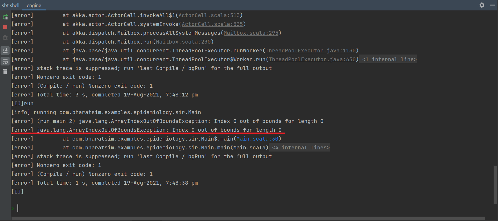

Miscellaneous
=============

Assembling an Executable Jar file
---------------------------------

A ``jar`` file is an executable java file that can be used to run your code.

1.  Go to the sbt shell in IntelliJ, and type ``assembly``

    .. figure:: _static/images/jar-doc-1.png
        :align: center

        sbt shell

2. The shell will display all the ``Main.scala`` files which are present in your directory. Select the one you want to run by typing it's index in the shell.
   
3. The shell will display all the ``Main.scala`` files which are present in your directory. Select the one you want to run by typing it's index in the shell.
   
4. Alternatively, you can specify which ``Main.scala`` file you want to run in the ``build.sbt`` file by typing the following command :-

    .. figure:: _static/images/jar-doc-4.png
        :align: center
        
        This will run the ``Main`` file in the ``sir\textunderscore ct`` folder

5. The sbt shell will display that the following tests were *unsuccessful*:-
   
        a. item Neo4jProviderTest
        b. item BatchNeo4jProviderTest
        c. item ReadOperationsStreamTest
        d. item WriteOperationsStreamTest

Go to ``BharatSim\src\test\scala\com\bharatsim\engine\graph\neo4j`` and comment out (``ctrl + /``) all the lines in the test files for tests (a) and (b). Open the ``queryBatching`` folder in the same directory and comment out all lines for tests (c) and (d). 

1. Open ``BharatSim\target\scala-2.13`` where you will find the new JDK JAR file created. It should have the name``engine-assembly-0.1``. You can now keep the file here or move it to a folder/directory of your choice.

2. Open a terminal (powershell/gitbash/linux shell, etc.) in the directory/folder in which you have saved your JDK JAR file and type ``java -jar jarfilename``.

    .. figure:: _static/images/jar-doc-3.png
        :align: center

Using args in main method
-------------------------

While using the ``run`` command on the sbt shell, one can pass in some ``string`` arguments. These arguements can be called by the main function.

For example, one might want to change the name of the output file everytime they run the code. Instead of changing the output name manually each time, one can write a code like the one given below.

.. code-block:: scala

      def main(args: Array[String]): Unit = {
        outputName = args(0)
        }
        
One could use the ``outputName`` and use it in the name of the csv file, for eg. 

.. code-block:: scala

    SimulationListenerRegistry.register(
        new CsvOutputGenerator(outputName+".csv", new SEIROutputSpec(context))
      )

To implement this, one must go to the ``sbt shell`` and type ``run "my_sir_model"``. If this were to be used on the code-block above, the output csv file will be named as ``my_sir_model.csv``. However, if one runs the file without specifiying the arguement, it will show an error:

One can also run a Main file by creating a `.jar` file, as described above and then running ``java -jar file.jar [ arguments ]``

Outputting the age-stratified number of people per place
--------------------------------------------------------

.. tip:: Before reading this section, it's recommended that you read the basics in the :ref:`Outputs` section.

In this section, we discuss how to create the following output:

* We require the function to accept a workplace type as a string (i.e. "Home", "Office", "School" in our model), and create a CSV file with the output.
* Each file should have the Location type ("Home", etc.) the location ID, and the number of people per location broken up by age-group (<18, 18-45, 45-60, 60+)

Let's call our user-defined function ``myCsvOutputSpec`` for now. First, we'll create a scala class for it which is an extention of the ``CsvSpecs`` trait:

.. code-block:: scala

    class myCsvOutputSpec(placeType: String, context: Context) extends CSVSpecs {}

Next, we ovverride the ``getHeaders`` function with the appropriate list of headers:

.. code-block:: scala

    override def getHeaders: List[String] = List("PlaceType", "LocationID", "N <18", "N 18-45", "N 45-60", "N >60")

Before overriding ``getRows``, let's write down two functions which we'll be needing inside of it. The first is the ``decodeNode`` method, which converts a ``GraphNode`` to a ``Node``

.. code-block:: scala

  def decodeNode(classType: String, node: GraphNode): Node = {
    classType match {
      case "House" => node.as[House]
      case "Office" => node.as[Office]
      case "School" => node.as[School]
    }
  }

The next method is called ``getId``, and it retrieves the location ID of a ``GraphNode``. In our program, the ``House``, ``Office`` and ``School`` classes all have an attribute called ``id``, so this function is designed to return that attribute.

.. code-block:: scala

  def getId(classType: String, node: GraphNode) : Long = {
    classType match {
      case "House" => node.as[House].id
      case "Office" => node.as[Office].id
      case "School" => node.as[School].id
    }
  }

.. hint:: Looking at this function, you may think it's unnecessary: it looks almost identical to ``decodeNode``! Why not just use ``decodeNode(classType, node).id``? In that case, however, note that ``decodeNode`` returns a ``Node``, which does not have an ``id`` attribute.

    By playing around with the function, you may find out that the ``GraphNode`` attribute *does* have an ``id``: so why not just write the function to return ``node.id``? The ``GraphNode.id`` attribute is a completely different number from the location ID, which is used to identify the node on the graph. As such, while the code will compile and run, the output under ``LocationID`` will have different results from what you'd expect.

Now, we can start to write down our ``getRows`` method. We want to be able to initialize a large list, every component of which is a list containing a row of the CSV file. While it sounds tempting to first initialize an empty list, and add lists to it one at a time, that is not possible in scala, as the ``List`` datatype is immutable. As such, we use the `ListBuffer <https://alvinalexander.com/scala/how-to-create-mutable-list-in-scala-listbuffer-cookbook/>`_ datatype, which has a lot of useful methods.

.. code-block:: scala

  override def getRows(): List[List[Any]] = {

    val rows = ListBuffer.empty[List[String]]

Next we get all the nodes of the correct ``placeType`` (which, remember, was a string that the function accepts as an argument)

.. code-block:: scala

    val locations = context.graphProvider.fetchNodes(placeType)

Iterating over each location, which we call ``oneLocation``:

.. code-block:: scala

    locations.foreach(oneLocation => {

We generate a ``decodedLoc`` and ``locId`` using our ``decodeNode`` and ``getId`` functions respectively

.. code-block:: scala

      val decodedLoc = decodeNode(placeType, oneLocation)
      val locId = getId(placeType, oneLocation).toString

.. note:: We convert ``locId`` to a string, as it's what we need to fill out as the second element of the row.

We then calculate the number of people in each age group who are associated with the location: This is done with ``getConnectionCount``, where we feed in the relation between the location and the person, and then the age-requirement. We then convert the numbers to strings.

.. code-block:: scala

      val N_0_18 = decodedLoc.getConnectionCount(decodedLoc.getRelation[Person]().get,
        "age" lt 18).toString
      val N_18_45 = decodedLoc.getConnectionCount(decodedLoc.getRelation[Person]().get,
        ("age" gte 18) and ("age" lt 45)).toString
      val N_45_60 = decodedLoc.getConnectionCount(decodedLoc.getRelation[Person]().get,
        ("age" gte 45) and ("age" lt 60)).toString
      val N_60_100 = decodedLoc.getConnectionCount(decodedLoc.getRelation[Person]().get,
        "age" gte 60).toString

Now, we add this row to ``rows``, the ``ListBuffer`` object 

.. code-block:: scala

      rows.addOne(List(placeType, locId, N_0_18, N_18_45, N_45_60, N_60_100))

Finally, outside of the iterator, we convert the ``ListBuffer`` to a ``List`` and return it

.. code-block:: scala

    rows.toList

Putting it all together, the class is 

.. code-block:: scala

    class myCsvOutputSpec(placeType: String, context: Context) extends CSVSpecs {

        override def getHeaders: List[String] = List("PlaceType", "LocationID", "N_<18", "N_18-45", "N_45-60", "N_>60")

        override def getRows(): List[List[Any]] = {

            val rows = ListBuffer.empty[List[String]]

            val locations = context.graphProvider.fetchNodes(placeType)

            locations.foreach(oneLocation => {
            val decodedLoc = decodeNode(placeType, oneLocation)
            val locId = getId(placeType, oneLocation).toString
            val N_0_18 = decodedLoc.getConnectionCount(decodedLoc.getRelation[Person]().get, "age" lt 18).toString
            val N_18_45 = decodedLoc.getConnectionCount(decodedLoc.getRelation[Person]().get, ("age" gte 18) and ("age" lt 45)).toString
            val N_45_60 = decodedLoc.getConnectionCount(decodedLoc.getRelation[Person]().get, ("age" gte 45) and ("age" lt 60)).toString
            val N_60_100 = decodedLoc.getConnectionCount(decodedLoc.getRelation[Person]().get, "age" gte 60).toString

            rows.addOne(List(placeType, locId, N_0_18, N_18_45, N_45_60, N_60_100))
            })
            rows.toList
        }

        def decodeNode(classType: String, node: GraphNode): Node = {
            classType match {
            case "House" => node.as[House]
            case "Office" => node.as[Office]
            case "School" => node.as[School]
            }
        }

        def getId(classType: String, node: GraphNode) : Long = {
            classType match {
            case "House" => node.as[House].id
            case "Office" => node.as[Office].id
            case "School" => node.as[School].id
            }
        }

    }

.. tip:: If you want to use this code snippet, be sure to import the following

    .. code-block:: scala

        import com.bharatsim.engine.Context
        import com.bharatsim.engine.basicConversions.decoders.DefaultDecoders._
        import com.bharatsim.engine.basicConversions.encoders.DefaultEncoders._
        import com.bharatsim.engine.graph.GraphNode
        import com.bharatsim.engine.graph.patternMatcher.MatchCondition._
        import com.bharatsim.engine.listeners.CSVSpecs
        import com.bharatsim.engine.models.Node
        import scala.collection.mutable.ListBuffer

As we only need to call this function once after data ingestion, we add the following inside ``simulation.defineSimulation``:

.. code-block:: scala

    var outputGenerator = new CsvOutputGenerator("output.csv", new myCsvOutputSpec("House", context))
    outputGenerator.onSimulationStart(context)
    outputGenerator.onStepStart(context)
    outputGenerator.onSimulationEnd(context)

The output should be of the form

.. csv-table:: output.csv
   :file: _static/csvs/people_per_home_truncated.csv
   :widths: 5, 5, 5, 5, 5, 5
   :header-rows: 1
