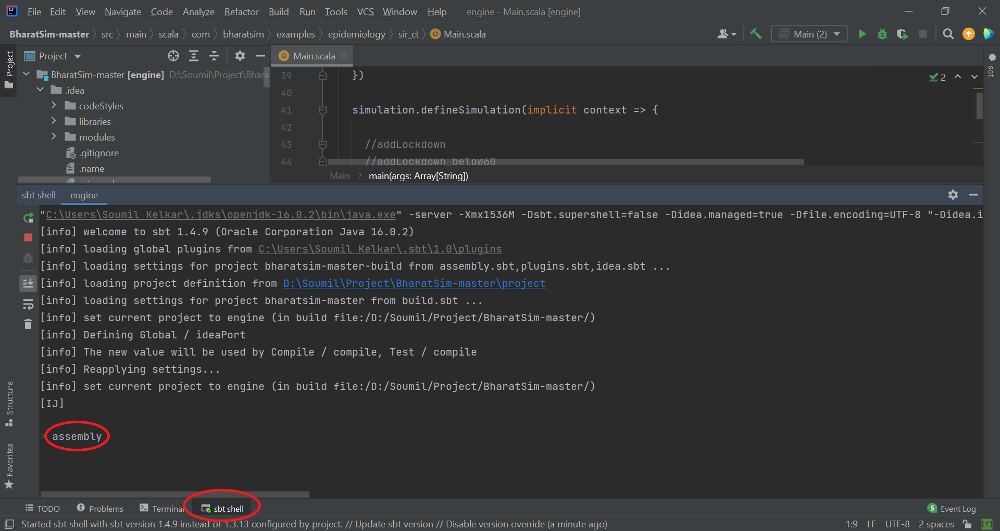
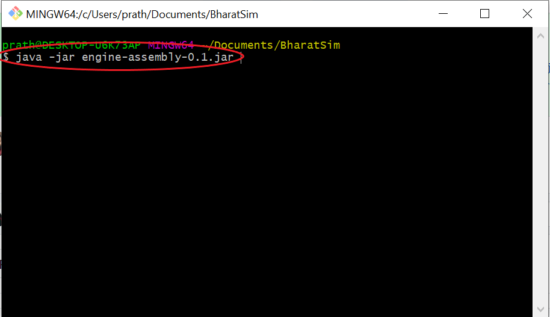

Assembling an Executable Jar file
===================================

Introduction
------------

This page highlights how you can make a ``jar`` file from any of the models that you create. A ``jar`` file is an executable java file that can be used to run your code

Steps for creating and executing a new jdk jar file
----------------------------------------------------

1.  Go to the sbt shell in IntelliJ, and type ``assembly``

    sbt shell

2. The shell will display all the ``Main.scala`` files which are present in your directory. Select the one you want to run by typing it's index in the shell.
3. The shell will display all the ``Main.scala`` files which are present in your directory. Select the one you want to run by typing it's index in the shell.
4. Alternatively, you can specify which ``Main.scala`` file you want to run in the ``build.sbt`` file by typing the following command :-

.. figure:: _static/images/jar-doc-4.png
    :width: 200px
    :align: center
    :height: 100px
    :alt: alternate text
    :figclass: align-center
    
    This will run the ``Main`` file in the ``sir\textunderscore ct`` folder

5. The sbt shell will display that the following tests were *unsuccessful*:-
        a. item Neo4jProviderTest
        b. item BatchNeo4jProviderTest
        c. item ReadOperationsStreamTest
        d. item WriteOperationsStreamTest
Go to ``BharatSim\src\test\scala\com\bharatsim\engine\graph\neo4j`` and comment out (``ctrl + /``) all the lines in the test files for tests (a) and (b). Open the ``queryBatching`` folder in the same directory and comment out all lines for tests (c) and (d). 

7. Open ``BharatSim\target\scala-2.13`` where you will find the new JDK JAR file created. It should have the name``engine-assembly-0.1``. You can now keep the file here or move it to a folder/directory of your choice.

8. Open a shell(powershell/gitbash/linux shell , etc.) in the directory/folder in which you have saved your JDK JAR file and type ``java -jar jarfilename``.

    
.. class:: center

    GIT bash

Using args in main method
==========================
While using the ``run`` command on the sbt shell, one can pass in some ``string`` arguments. These arguements can be called by the main function. 
For example, one might want to change the name of the output file everytime they run the code. Instead of changing the output name manually each time, one can write a code like the one given below.

.. code::

      def main(args: Array[String]): Unit = {
        outputName = args(0)
        }
        
One could use the ``outputName`` and use it in the name of the csv file, for eg. 

.. code::

    SimulationListenerRegistry.register(
        new CsvOutputGenerator("C:\\Users\\username\\Documents\\"+outputName+".csv", new SEIROutputSpec(context))
      )

To implement this, one must go to the ``sbt shell`` and type ``run "my_sir_model"``. If this were to be used on the code-block above, the output csv file will be named as ``my_sir_model.csv``. However, if one runs the file without specifiying the arguement, it will show an error:

.. figure:: _static/images/jar-doc-5.png
    :width: 200px
    :align: center
    :height: 100px
    :alt: alternate text
    :figclass: align-center
    
    

One can also run a Main file by creating a `.jar` file, as described above and then running ``java -jar file.jar [ arguments ]``

