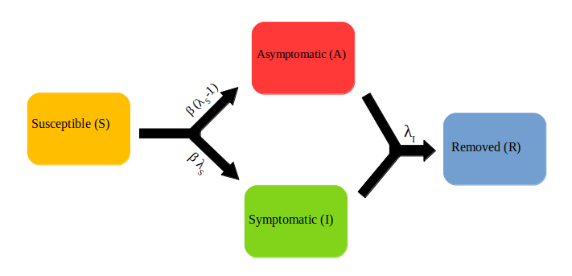

Other Compartmental Models
==========================

The SAIR Model
--------------

The SIR and SEIR models are established with the assumption that people contact with each other in a homogeneous pattern. However, owing to the difference 
of individuals in reality, social contact is usually heterogeneous, and the models on homogeneous networks cannot accurately describe the outbreak. Hence 
the SAIR model was introduced [1]. The two new compartments are Asymptomatic (A) or Symptomatic (I). The fraction of infected individuals showing or experiencing
no symptoms are categorised as Asymptomatic (A). Individuals from both Asymptomatic as well as Symptomatic compartments are moved to the Removed (R) compartment
upon recovery. The diagram below shows how the individuals move through each compartment in this model.

The rate of transmission of the disease from an infected to a susceptible is represented by :math:`{\beta}` . Thus the rate of transfer of an infected individual 
from the Susceptible compartment to the Symptomatic (I) compartment is :math:`{\beta}{\lambda_S}` and to the Asymptomatic (A) compartment is :math:`{\beta}({\lambda_S-1})`
, where :math:`{\lambda_S}` represents the fraction of the infected individuals who are symptomatic. At last, :math:`{\lambda_I}`
represents the rate of removal of infected individuals from the I and A compartments.

The set of coupled non-linear differential equations that defines the SAIR model in a closed population are:

.. math::

 \begin{aligned}
   \frac{dS}{dt} = \frac{ -\beta \lambda_S SI }{N} + \frac{ -\beta (\lambda_S-1) SA }{N} \\ \\
   \frac{dI}{dt} = \frac{ \beta \lambda_S SI }{N} - \lambda_I I \\ \\                                    
   \frac{dA}{dt} = \frac{ \beta (\lambda_S-1) SA }{N} - \lambda_I A \\ \\                            
   \frac{dR}{dt} = \lambda_I (A+I)
 \end{aligned} 

where the total population, 

.. math::

 N = S + I + A + R

Introducing the Asymptomatic (A), Symptomatic (I) branching neither changes the total number of infections nor affects the total duration of the epidemic. 
On the other hand, we could add more complexity to the model by introducing different infection rates ie, making the symptomatic individuals more infectious 
than the asymptomatic. We could also make the recovery rates different for the different infected groups. For a simple SAIR model, the graph maybe as shown below. 

.. image:: _static/images/sair.png

In an SAIR model, during each tick :math:`{\delta t}` , the individuals from the Susceptible compartment are checked for infection and are moved to a transient 
infected compartment using probability

.. math::

 P_{SIn} =  \frac{ -\beta \lambda_S I \delta t}{N} + \frac{ -\beta (\lambda_S-1) A \delta t}{N}

The infected individuals then transit out of this temporary compartment to the Symptomatic (I) and Asymptomatic (A) compartments using probabilities  
:math:`{\lambda_S}` and :math:`{(\lambda_S-1)}` respectively.

The asymptomatic and symptomatic individuals after spending an average time of :math:`{1/\lambda_I}` days in their respective compartments, are transferred to 
the recovered compartment with a probability 

.. math::

 P_{R} = \lambda_I \delta t.
